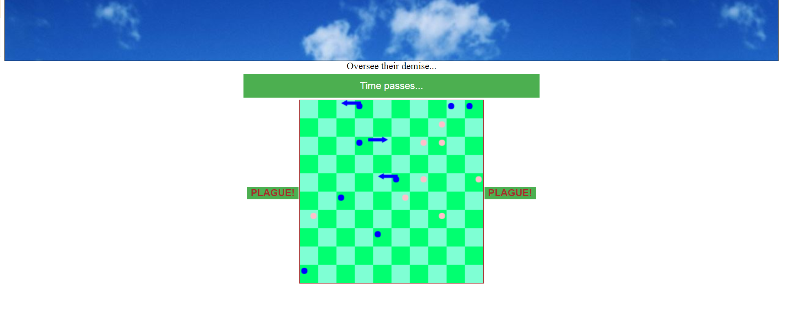

# rabbit-game
A simulation with some player interactivity. It features dots that jump around randomly. Two forces act against each other: procreation versus death. Pregnancies create more rabbits while age, evil rabbits and plagues remove rabbits. 

The above is a look at the game's starting condition.
